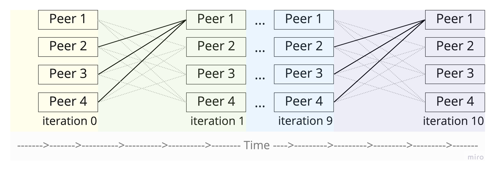
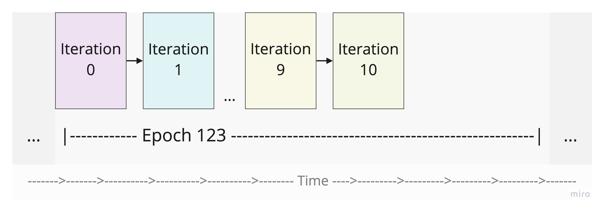

# Epochs and Iterations

There are two types of intervals in Eigen Trust:

### Iterations - short intervals:

They are ticking every \~10s and in each tick one iteration of Eigen Trust algorithm is calculated. The number of tick is fixed (depending on how many iterations we need for convergence).

At every iteration nodes will send requests to each other for Iteration Validity Proofs (IVPs). Since every peer will have `n` managers, the requests will be sent to all `n`, assuming that at least one of them will provide correct proof, and be on time. All nodes that did not reply on time or provided invalid proof, will have their score slashed by the requesting peer (broadcast a `0` score into DHT network).

<figure><figcaption><p>Illustration of iteration intervals.</p></figcaption></figure>

### Epochs - long intervals:

At the start of an epoch, we are kickstarting the convergence process by starting the Iteration interval. Epoch last much longer than iterations. e.g. one epoch might last 24 hours, while the whole 10 iteration can last 30 minutes. So, most of the time available in the epoch, the network will do nothing. Allowing the nodes to compute other proofs (like CVPs), respond to RPC requests or similar.

<figure><figcaption><p>Illustration of Epoch interval.</p></figcaption></figure>

In order for the network to work properly, the nodes have to start the epoch at the same time, otherwise their iterations will not run in parallel, therefore blocking the whole network from progressing.

To solve that, every node will use UNIX timestamps to calculate the interval times. The epoch starting time is based on the UNIX timestamp from the beginning (00:00:00 UTC on 1 January 1970):

```rust
let until_now = now - UNIX_TIME;
let current_epoch = unix_timestamp.as_secs() / interval.as_secs();
```

If we want to calculate when is the next epoch starting:

```rust
let secs_until_next_epoch = (current_epoch + 1) * interval.as_secs() - until_now.as_secs();
```

Then we want to start an interval starting at `now + secs_until_next_epoch`, which will repeat every `interval` seconds.

```rust
let start = now.as_secs() + secs_until_next_epoch
let mut interval = time::interval_at(start, interval.as_secs());
```

Visual illustration:

```rust
0   3600s  1          2          3          4          5          6          7
|----------|----------|----------|----------|----------|----------|----------|
                                    now^    ^start of the interval
```

This way we are ensuring that every node has the same starting time on every Epoch.

### Future optimisation

Not requesting IVPs from every manager of the peer N would reduce the computational load on every node. We can create a third class of intervals that are running within the Iteration interval. We can call it Session intervals - Instead of requesting the IVPs from every manager, we request from just one, at each session.

If the mangers doesn't reply, or provides a false proof, we will slash him (distributing a `0` score in the DHT network).

If the manager does reply with correct proof, we will give him an `x` amount of reputation.

The process of choosing to which manager we will send requests should be calculated based on their reputation in previous Epoch, in a following way:\
\- First we find all the managers for peer N.\
\- We query their reputation, and normalise it.\
\- We pick a random manager based on this normalised distribution.
